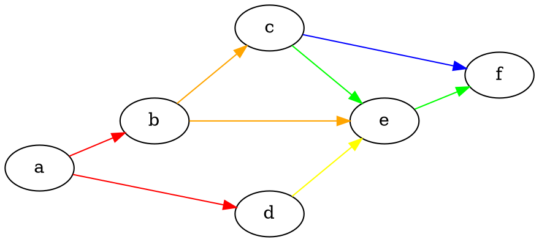
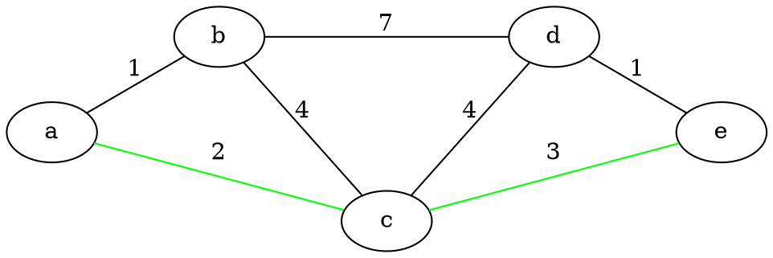
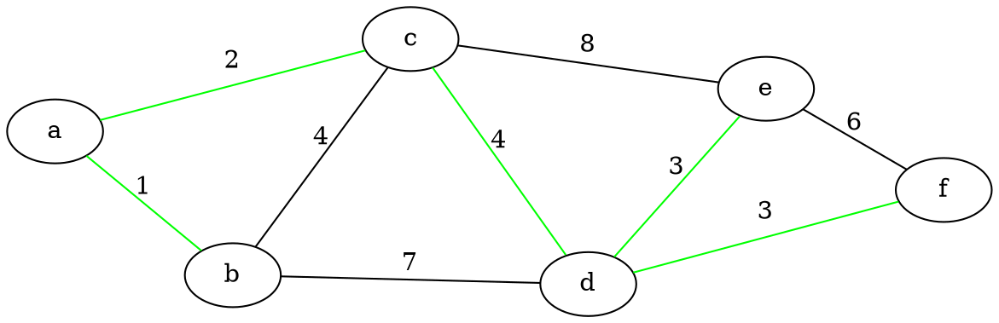
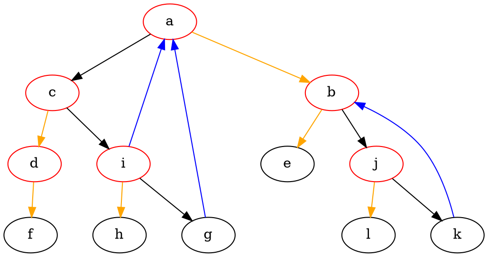
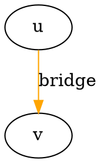
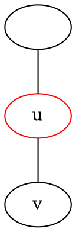
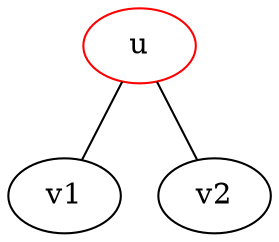
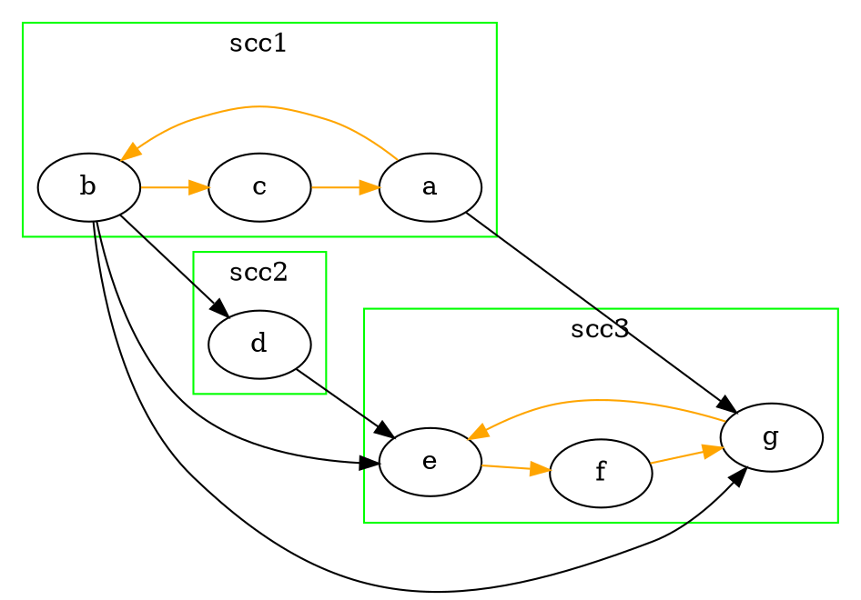

# 圖論

<!-- more -->

## 拓樸排序 Topological order



### 方法1. 計算 in-degre

1. 將每一點的入度數算出
2. 入度數為0的點push進queue裡面
3. 將queue裡點的點拿出並將邊刪除
4. 刪除邊後的點入度數若為0則push進去queue
5. queue pop的順序為一組topological order
6. 若有結束後有入度數不為0的代表有環

### 方法2. dfs

* dfs未完成前又回到原dfs的點則圖有環
* dfs的過程為ㄧ組topological order

---

## 單源最短路徑


### 方法1. Bellman-Ford

#### 適用情形：

* 有負邊
* 檢測負環

#### **init:**

$\qquad$$edges = {(u_1, v_1), (u_2, v_2), (u_3, v_3), ... (u_m, v_m)}\\$
$\qquad$$d[n]={\infty}, d[start]=0\\$

#### **solve:**

$\qquad$ $for\:vertex=1\sim n:\\$
$\qquad$$\qquad$$for(u,v)\;in\;edges\\$
$\qquad$$\qquad$$\qquad$$d[vertex]=min(d[vertex],\:d[vertex]+cost(u,v))"鬆弛邊"\\$

* $複雜度O(nm)$


### 方法2. Dijkstra

#### 適用情形：

* 無負邊
* 時間限制較緊

#### **init:**

$\qquad$$d[n]=\infty,d[start]=0$

#### **solve:**

1. 將start點push進priority queue
2. 將top點依序拿出，連接的點若可更新權重，則更新為d[start]+cost，並push進priority queue
3. priority queue內為空則結束

* $複雜度O(mlogm)$

---

## 多源最短路徑

### Floyd-Warshall

#### **solve:**

$\qquad for\:k=1\sim n: \\$
$\qquad\qquad for\ i=1\sim n: \\$
$\qquad\qquad\qquad for\ j=1\sim n: \\$
$\qquad\qquad\qquad\qquad dp[i][j]=min(dp[i][j],\ d[i][k]+dp[k][j])$

* $複雜度O(n^3)$

---

## 並查集 disjoint-set

```cpp=
int Find(int x){
    if(parrent[x] == x){
        return x;
    }
    else{
        return parrent[x] = Find(parrent[x]);
    }
    
}

void Union(int x, int y){
    parrent[Find(x)] = Find(y);
    return
}
```
### 路徑壓縮

* $parrent[Find(x)] = Find(y)$
* 複雜度:$O(log^*n)$

### 啟發式合併 union by rank

* rank: size of tree

---

## 最小生成樹 MST


### 方法1. kruskal

1. 將邊的cost由小到大排序
2. 將邊上的點依序Union，若已為同一群則忽略
3. $ans=\sum沒被忽略的邊$

* $複雜度O(mlogm)$

### 方法2. prim

#### **init:**

$\qquad$$d[n]=\infty,d[start]=0$

1. 隨機挑選start點加入 priority queue
2. 將top點依序拿出，連接的點若可更新權重，則更新為cost，並push進priority queue
3. priority queue內空則完成
4. $ans = \sum_{i=1}^{n}d[n]$

* $複雜度O(mlogm)$

---

## dfs tree


$t(u):進入u的時間\\$
$low(u):u最多經過一條backedge，可以走到的最小t值$

### bridge


$如果\ low(v)=t(v),\ 則u\rightarrow v為bridge$

### Articulation Point

#### Case1 $點u不是root$


$如果low(v)\ge t(v),\ 則點u為AP$

#### Case2 $點u是root$


$如果low(v_1)\ge t(v),\ 且low(v_2)\ge t(v),\ 則u為AP$

---

## 強聯通單元 SCC



### 性質

* 若將每一組scc視作一節點，則此圖必為DAG
* $如果sccA\rightarrow sccB$
$則max\{t(a)|a\in A\}>max\{t(b)|a\in B\}$

---


